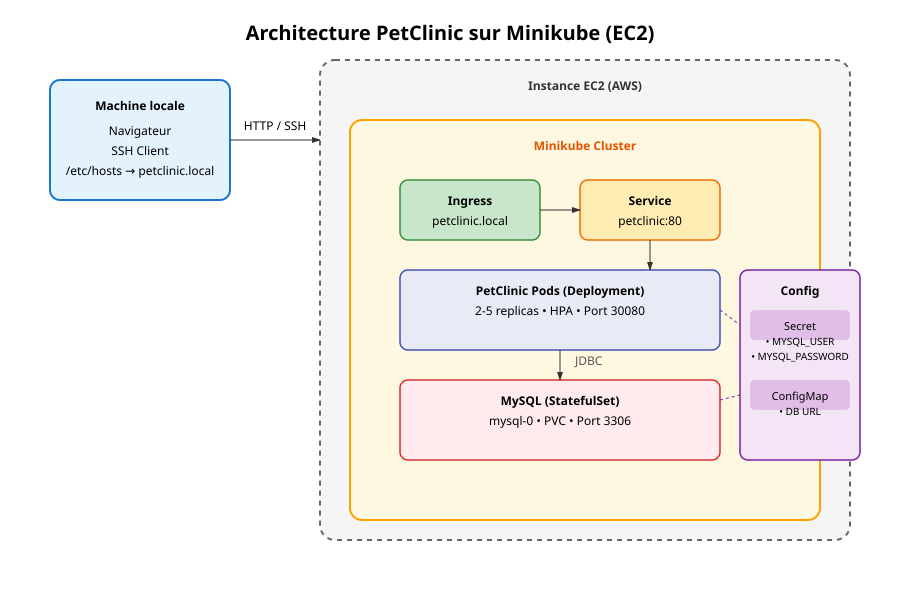

# Architecture du déploiement PetClinic sur AWS EKS

## 1. Diagramme d’architecture

---

## 2. Justification des choix techniques

### AWS EKS
- Cluster Kubernetes **managé**, haute disponibilité, sans gestion du control plane
- Intégration native avec IAM, EBS, CloudWatch

### Amazon ECR
- Registre d’images Docker **sécurisé**, privé, intégré à IAM
- Authentification via `aws ecr get-login-password`

### Amazon EBS (via CSI Driver)
- Stockage **persistant et fiable** pour MySQL
- Classe `gp2` : équilibre perf/prix, disponible par défaut

### Ingress Nginx + AWS Load Balancer
- Exposition publique via **Classic Load Balancer** géré par AWS
- Pas de dépendance à un hostname local → accès direct par URL ELB

---

## 3. Description des composants

### Cluster EKS
- Version 1.30
- 2 nœuds `c7i-flex.large` (2 vCPU, 4 GiB RAM)
- Autoscaling activé (1–3 nœuds)

### CSI Driver EBS
- Composant obligatoire pour provisionner des volumes EBS depuis Kubernetes
- Rôle IAM dédié avec politique `AmazonEBSCSIDriverPolicy`

### ECR Repository
- Image : `469860694516.dkr.ecr.eu-north-1.amazonaws.com/petclinic:1.0`

### Manifests modifiés pour EKS
| Fichier | Modification |
|--------|-------------|
| `mysql-pvc.yaml` | `storageClassName: gp2` (au lieu de `standard`) |
| `petclinic-deployment.yaml` | `image` = URL ECR + `imagePullPolicy: Always` |
| `petclinic-ingress.yaml` | Suppression de `host: petclinic.local` pour accès public |

### Monitoring
- **CloudWatch Container Insights** : métriques CPU/mémoire
- **Logs centralisés** dans CloudWatch Logs